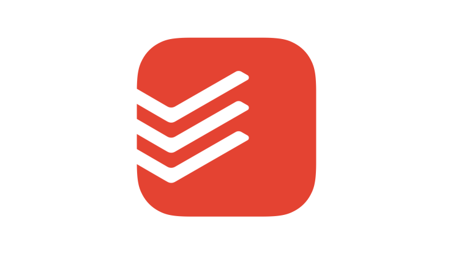

# MyProject

<p align="center">
  
</p>

# VitalMastery!

[](https://github.com/ppy/osu/actions/workflows/ci.yml)
[](https://github.com/ppy/osu/releases/latest)
[](https://www.codefactor.io/repository/github/ppy/osu)
[](https://discord.gg/ppy)
[](https://crowdin.com/project/osu-web)

## Краткое описание данного проекта:

- Основаня идея: Веб-сайт контроля питания и тренерок с отображением графиков и обсуждения в социальной сети.

- Функциональность:
Пользователи могут вести дневник питания и тренировок.
Создание графиков и отчетов по прогрессу.
Возможность установки целей и отслеживание их достижения.
Социальные функции: обмен результатами, поддержка других пользователей ну и т.д.

- Технологии:
Frontend: HTML, CSS, JavaScript,Возможно (React.js) ну это да да...
Backend: Node.js, Express.js
База данных: MongoDB

- Преимущества:
Удобный способ отслеживать прогресс в питании и тренировках на всех платформах как descktop так и на мобильных устойствах.
Возможность получать поддержку и вдохновение от других пользователей(Сомнительно ну окей).
Есть аналоги но почему бы  и нет.


## Status

Этот проект находится в стадии разработки,
Несколько ресурсов доступны в качестве отправной точки для участия и понимания проекта:


## Running VitalityMastery

в стадии разработки.

### Latest release:

в стадии разработки.

## Developing a custom ruleset

в процессе.

## Developing osu!

......... ..............

### Prerequisites

Пожалуйста, убедитесь, что у вас есть следующие предпосылки:

- Платформа настольного компьютера с установленным [.NET 8.0 SDK](https://dotnet.microsoft.com/download).

При работе с кодовой базой мы рекомендуем использовать IDE с интеллектуальным завершением кода и подсветкой синтаксиса, например последнюю версию [Visual Studio](https://visualstudio.microsoft.com/vs/), [JetBrains Rider](https ://www.jetbrains.com/rider/) или [Visual Studio Code](https://code.visualstudio.com/) с [EditorConfig](https://marketplace.visualstudio.com/items?itemName =EditorConfig.EditorConfig) и плагин [C#](https://marketplace.visualstudio.com/items?itemName=ms-dotnettools.csharp).

### Downloading the source code

Клонировать репозиторий:

```shell
git clone https://github.com/Larezma/MyProject
cd VitalityMastery
```

Чтобы обновить исходный код до последней версии коммита, выполните следующую команду в каталоге `VitalityMastery`:

```shell
git pull
```

### Building

в процессе.